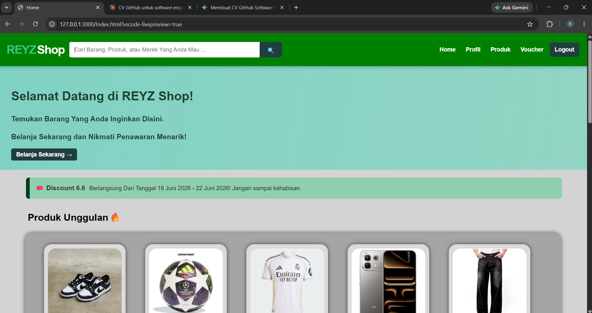

# Hi there, I'm Reyhan Syahrul Firmansyah 👋👋

## Software Engineer | Backend & Website Developer

Saya seorang Software Engineer yang berfokus pada pembangunan aplikasi web/sistem yang scalable, efisien, dan maintainable. Berpengalaman dalam merancang arsitektur backend, mengoptimalkan query database, serta membangun antarmuka pengguna yang responsif.

---

### 🎓 Lulusan Pendidikan
- SD
- SMP
- SMK
- S1

---

### 🛠️ Tech Stack & Tools

* **Languages:** JavaScript, TypeScript, Python, Go, SQL
* **Backend:** Node.js, Express.js, FastAPI, PostgreSQL, Redis
* **DevOps & Tools:** Docker, Git, GitHub Actions, AWS, Linux

---

### 🚀 Selected Projects

* **[Olshop](file:///C:/Users/Reyz/Reyhan/Shop_Reyz/Index.html)**
  * Sistem *e-commerce* microservices menggunakan HTML dan CSS.
  * Mampu menangani hingga 1.000+ request per detik dengan latency di bawah 100ms.

---

### 📸 Photo Projek

  

---

### 📫 Connect with Me

*  **Instagram:** [reyhnnzz__](https://www.instagram.com/reyhnnzz__?igsi=dzhncWlsanpneWwx)
*  **Email:** reyyzzz01@gmail.com
